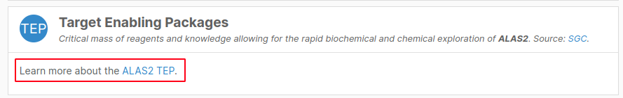

# Adding a new section

The profile tab for each of the entities (target, disease, drug and evidence) is broken up into sections. Each of these sections is encapsulated in one directory under `src/sections/<entity>/`. To add a new one, follow this structure:

```
src
└── sections
    └── <entity>
        └── <sectionId>
            ├── index.js
            ├── Summary.js
            ├── Body.js
            ├── Description.js
            ├── <sectionId>SummaryFragment.gql
            └── <sectionId>Query.gql
```

The following describe all the files in detail, following the simple [TEP section](https://github.com/opentargets/platform-app/tree/alpha/src/sections/target/Tep) from the `target` entity page as an example.

## <a name="index"></a> `index.js`

The `index.js` defines the section information as well as exporting its `Body`and `Summary` components:

```javascript
export const definition = {
  id: 'tep',
  name: 'Target Enabling Packages',
  // Optional, if not present it will default to the first character of the
  // first two words in the name.
  shortName: 'TEP',
  // hasData takes the data content of the summary query as its parameter, to
  // determine if there is data for this section (and therefore whether to
  // display its body or not.
  hasData: data => !!data.tep,
  // Optional, set to true if the section uses an external API instead.
  external: false,
};

export { default as Summary } from './Summary';
export { default as Body } from './Body';
```

## `Summary.js`

This component is in charge of handling the data acquisition for the summary, and must render the contents of the section's summary in the page's table of contents:


If the section uses [Open Target's GraphQL API](https://platform-api-alpha.opentargets.io/api/v4/graphql/browser), it must include a `fragments` field with the query. This is used to add the data to the context provider used by the profile page. The query should be imported as a separate .gql file whenever possible.

```javascript
const TEP_SUMMARY_FRAGMENT = loader('./TepSummaryFragment.gql');

function Summary({ definition }) {
  // ...
}

Summary.fragments = {
  TepSummaryFragment: TEP_SUMMARY_FRAGMENT,
};
```

<a name="summary"></a>
The summary component will be used in the entity's profile page, and will bring the following props:

- `id`: id of the entity (eg: `ENSG00000158578` for `ALAS2`).
- `label`: label of the entity, in case of a target it will contain the `approvedSymbol` field from the API (`ALAS2`).
- `definition`: the `definition` object exported by [`index.js`](#index).

The render must be done in using the render prop `renderSummary` of a root [`SummaryItem`](https://github.com/opentargets/platform-app/blob/alpha/src/components/Summary/SummaryItem.js) component. It must be passed the definition for the section, and takes a `data` parameter, which will contain the request's `data` field. It is safe to assume there will be data in there, as the `SummaryItem` takes care of the loading and error states.

For this to assumption to work when using custom requests, the `SummaryItem` component must be passed an object with the requests' state and data structured as follows:

| Field   | Type             | Description                     |
| ------- | ---------------- | ------------------------------- |
| loading | `bool`           | `true` for an in-flight request |
| error   | `object \| null` | should be `null` if no error    |
| data    | `object \| null` |                                 |

It is also worth noting that the for sections using [Open Target's GraphQL API](https://platform-api-alpha.opentargets.io/api/v4/graphql/browser), the summary should use the [`usePlatformApi` hook](https://github.com/opentargets/platform-app/blob/alpha/src/hooks/usePlatformApi.js) to store the summary data in the [context provider](https://github.com/opentargets/platform-app/blob/alpha/src/contexts/PlatformApiProvider.js), which later on can be retrieved from the section's body if it is needed. Passing the query as a parameter is optional, and it filters the object contents to only return the part relevant to this section.

```javascript
function Summary({ definition }) {
  const request = usePlatformApi(TEP_SUMMARY_FRAGMENT);

  return (
    <SummaryItem
      definition={definition}
      request={request}
      renderSummary={() => 'Available'}
    />
  );
}
```

## `Body.js`

This is the component in charge of rendering the section's main contents. It is also responsible for acquiring its data.



Just like the in the [Summary component](#summary), the Body is used in the entity's profile page and brings the same `id`, `label` and `definition` props. It also uses a `renderBody` to render its contents. It has the same `definition` and `request` props, and now includes a `renderDescription` prop to take care of the [titlebar description](#description).

In this example, it is enough for the body to use the data fetched by the summary, so it uses the `usePlatformApi` hook like the summary:

```javascript
const Section = ({ definition, label: symbol }) => {
  const request = usePlatformApi(Summary.fragments.TepSummaryFragment);

  return (
    <SectionItem
      definition={definition}
      request={request}
      renderDescription={() => <Description symbol={symbol} />}
      renderBody={data => (
        <>
          Learn more about the{' '}
          <Link to={data.tep.uri} external>
            {data.tep.name} TEP
          </Link>
          .
        </>
      )}
    />
  );
};
```

Other cases might need a specific separate query: this can be loaded with the `useQuery` hook:

```javascript
const INDICATIONS_QUERY = loader('./IndicationsQuery.gql');

function Body({ definition, id: chemblId, label: name }) {
  const request = useQuery(INDICATIONS_QUERY, { variables: { chemblId } });

  return (
    <SectionItem
      definition={definition}
      request={request}
      renderDescription={() => <Description name={name} />}
      renderBody={data => {
        const { rows } = data.drug.indications;

        return <DataTable columns={columns} rows={rows} />;
      }}
    />
  );
}
```

## <a name="description"></a>`Description.js`

This component contains the description shown in the section's body's title bar:


```javascript
function Description({ symbol }) {
  return (
    <>
      Critical mass of reagents and knowledge allowing for the rapid biochemical
      and chemical exploration of <strong>{symbol}</strong>. Source:{' '}
      <Link external to="https://www.thesgc.org/tep">
        SGC
      </Link>
      .
    </>
  );
}
```

## <a name="summary-query"></a>`<sectionId>SummaryFragment.gql`

This is the `gql` query fragment for the summary described above.

```javascript
fragment TepSummaryFragment on Target {
  id
  tep {
    uri
    name
  }
}
```

## <a name="section-query"></a>`<sectionId>Query.gql`

This is the `gql` query for the Body of this section.

```javascript
query IndicationsQuery($chemblId: String!) {
  drug(chemblId: $chemblId) {
    id
    indications {
      rows {
        maxPhaseForIndication
        disease {
          id
          name
          therapeuticAreas {
            id
            name
          }
        }
        references {
          ids
          source
        }
      }
    }
  }
}
```

# Other examples

- [Related Diseases](https://github.com/opentargets/platform-app/tree/alpha/src/sections/disease/RelatedDiseases): Uses Platform-API with separate queries for summary and body.
- [Comparative Genomics](https://github.com/opentargets/platform-app/tree/alpha/src/sections/target/ComparativeGenomics): External API.
- [Baseline Expression](https://github.com/opentargets/platform-app/tree/alpha/src/sections/target/Expression): Platform-API in the summary; both Platform-API and external API in the body, uses a query inside each subcomponent.

# Other documentation

- [A quick guide for migrating components from the old structure](https://github.com/opentargets/platform/issues/1131#issuecomment-697681546).
